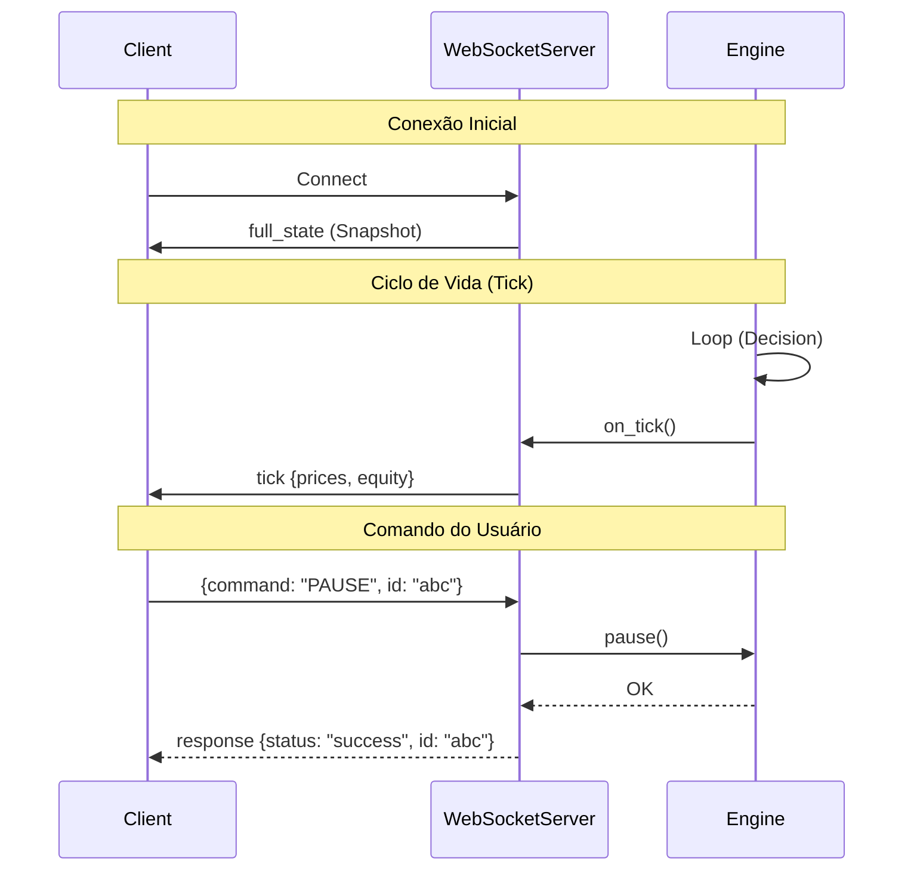

# 🔌 Oracle Trader v2 - Protocolo WebSocket

Este documento descreve o protocolo de comunicação entre o **Oracle Trader v2 (Server)** e seus clientes (Dashboard, Apps, etc).

## 🗺️ Visão Geral

O servidor WebSocket atua como a interface de controle e monitoramento em tempo real do sistema. Ele é orquestrado pelo `main.py` e se conecta diretamente aos callbacks do `Engine`.

### Integração (Python)

```python
# main.py
ws_server = WebSocketServer(host, port)
ws_server.set_engine(engine)  # Conecta callbacks automaticamente

# Fluxo de Dados:
# Engine (Event) → WebSocketServer.broadcast_*() → Clientes Conectados
```

---

## 📡 Mensagens Enviadas (Server → Client)

O servidor envia mensagens JSON assíncronas para notificar mudanças de estado.

### 1. `full_state`
Enviado imediatamente após a conexão de um cliente. Contém o snapshot atual do sistema.
```json
{
  "type": "full_state",
  "data": {
    "balance": 10500.50,
    "equity": 10550.00,
    "positions": [...],
    "formatted_status": "Running ...",
    "global_config": {...}
  }
}
```

### 2. `tick`
Atualização periódica (tipicamente 1s) com dados vitais.
```json
{
  "type": "tick",
  "data": {
    "price": {"EURUSD": 1.0500, ...},
    "balance": 10500.50,
    "equity": 10550.00,
    "pnl_open": 49.50
  }
}
```

### 3. `trade`
Notifica abertura, fechamento ou modificação de posições.
```json
{
  "type": "trade",
  "data": {
    "symbol": "EURUSD",
    "action": "OPEN",
    "price": 1.0505,
    "size": 0.01,
    "ticket": 123456
  }
}
```

### 4. `event`
Eventos críticos do sistema ou de gestão de risco.
*   **Tipos comuns:** `SL_PROTECTION`, `TP_GLOBAL`, `ERROR`, `WARNING`.

```json
{
  "type": "event",
  "data": {
    "level": "WARNING",
    "message": "SL Protection ativado para EURUSD",
    "timestamp": "2026-02-02T15:00:00"
  }
}
```

### 5. `log`
Stream de logs para debug remoto.
```json
{
  "type": "log",
  "data": {
    "level": "INFO",
    "message": "Engine loop started."
  }
}
```

### 6. `response`
Resposta direta a um comando enviado pelo cliente (Request-Response).
```json
{
  "type": "response",
  "id": "req-123",
  "status": "success",
  "result": { ... }
}
```

---

## 🎮 Comandos Disponíveis (Client → Server)

Os clientes enviam comandos no formato JSON. O campo `command` é obrigatório.

### Controle do Sistema
| Comando | Descrição |
|---------|-----------|
| `PAUSE` | Pausa o loop de decisão do Engine (não fecha posições). |
| `RESUME` | Retoma o loop de decisão. |
| `EMERGENCY_STOP` | **AÇÃO CRÍTICA**: Pausa o sistema e tenta fechar TODAS as posições imediatamente. |

### Gestão de Posições
| Comando | Parâmetros | Descrição |
|---------|------------|-----------|
| `CLOSE_ALL` | - | Fecha todas as posições abertas. |
| `CLOSE_POSITION` | `ticket` (int) | Fecha uma posição específica pelo ticket. |

### Gestão de Símbolos
| Comando | Parâmetros | Descrição |
|---------|------------|-----------|
| `BLOCK_SYMBOL` | `symbol` (str) | Impede novas operações no símbolo. |
| `UNBLOCK_SYMBOL` | `symbol` (str) | Libera operações no símbolo. |
| `FORCE_NORMAL` | `symbol` (str) | Força o estado do símbolo para `NORMAL` (sai de quarentena/warmup). |

### Configuração e Informação
| Comando | Parâmetros | Descrição |
|---------|------------|-----------|
| `GET_CONFIG` | - | Retorna a configuração global atual. |
| `SET_CONFIG` | `key`, `value` | Altera uma configuração em tempo de execução. |
| `GET_STATE` | - | Retorna o estado interno dos símbolos. |
| `GET_POSITIONS` | - | Retorna lista de posições abertas. |
| `GET_STATS` | - | Retorna estatísticas da sessão. |
| `LIST_MODELS` | - | Lista modelos ML carregados e disponíveis. |
| `GET_COMMANDS` | - | Retorna lista de comandos suportados (auto-discovery). |

---

## 🔄 Diagrama de Fluxo


